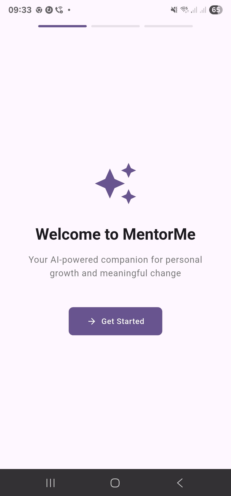
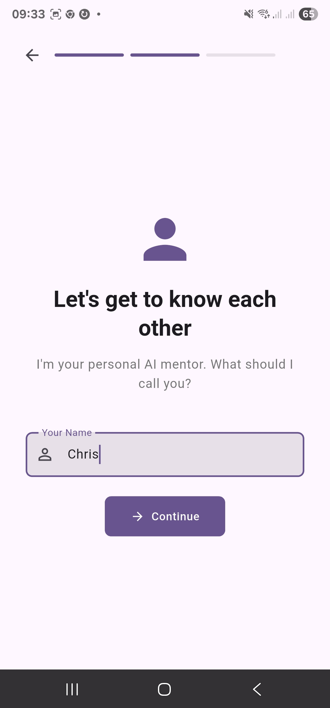
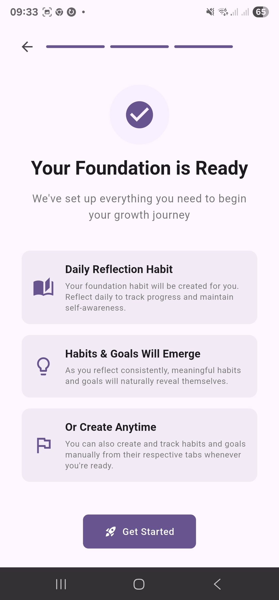
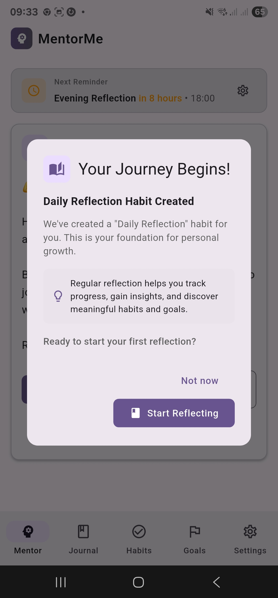
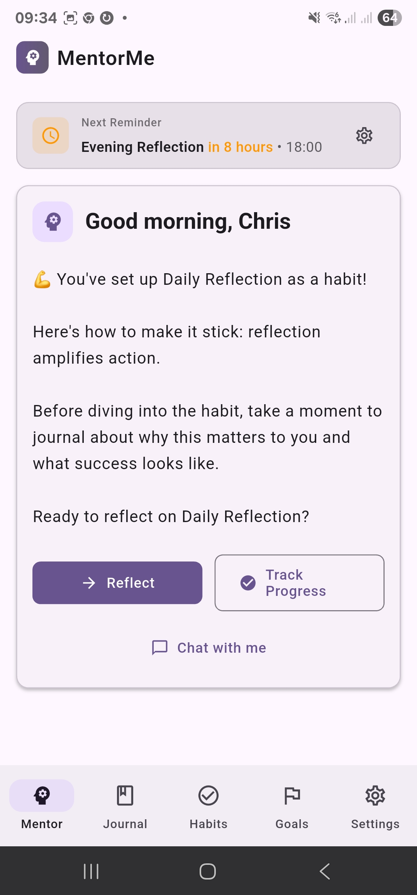
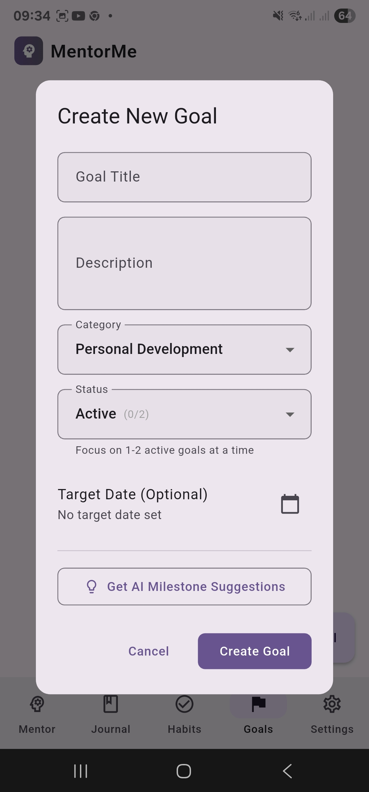
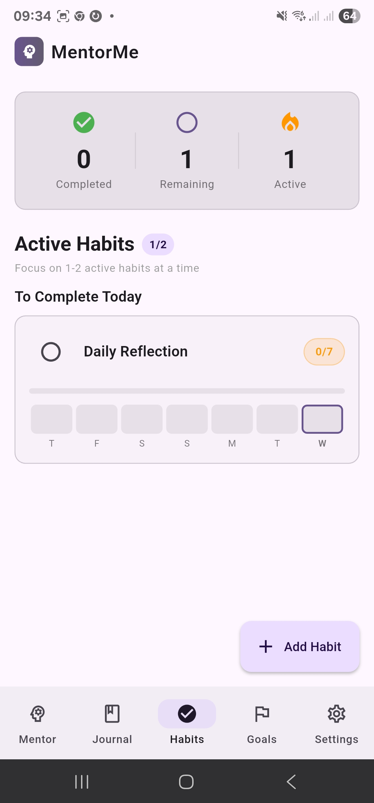
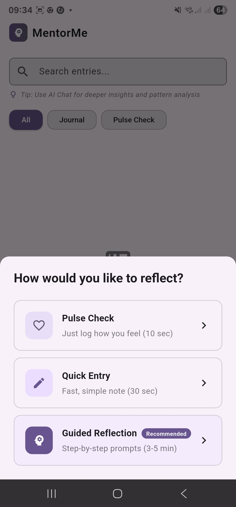
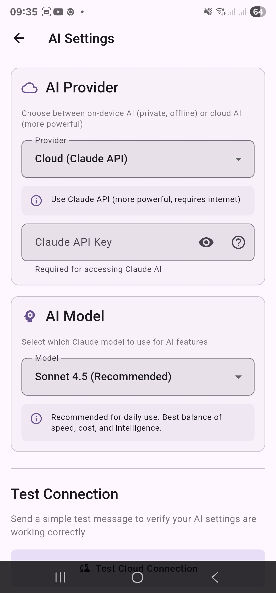
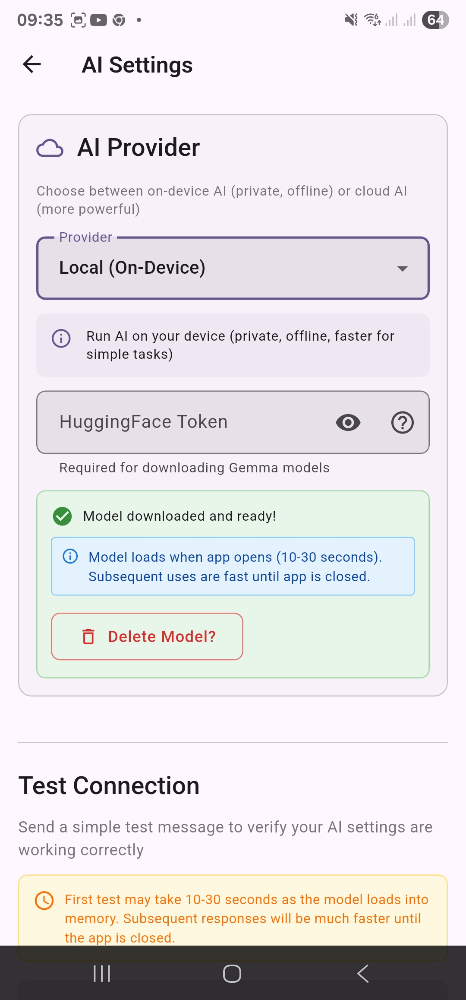

# MentorMe

<div align="center">

**AI-Powered Personal Growth Companion**

An intelligent mentor and coach for goal tracking, habit building, and personal development.

[](https://flutter.dev)
[](https://dart.dev)
[](LICENSE)

[Features](#features) • [Getting Started](#getting-started) • [Documentation](#documentation) • [Contributing](#contributing)

</div>

---

## Overview

MentorMe is a comprehensive personal growth application that combines goal tracking, habit building, and journaling with AI-powered coaching. Choose between Claude's advanced cloud-based language models or privacy-focused local AI running entirely on your device. MentorMe provides personalized guidance, insights, and motivation to help you achieve your goals.

### Key Highlights

- **Flexible AI Options**: Choose between cloud-based Claude API or on-device local AI models
- **Intelligent Mentoring**: AI analyzes your progress and provides contextual coaching
- **Goal Management**: Track goals with milestones, deadlines, and progress monitoring
- **Habit Building**: Build lasting habits with streak tracking and smart reminders
- **Reflective Journaling**: Capture thoughts, moods, and energy levels with guided prompts
- **Pulse Check-ins**: Quick mood and energy tracking throughout the day
- **Chat Interface**: Natural conversations with your AI mentor
- **Privacy-First**: All data stored locally, with optional offline AI for complete privacy

---

## Screenshots

<div align="center">

### Onboarding Experience
   

### Home & Core Features
   

### AI Configuration
 

</div>

---

## Features

### 🎯 Goal Tracking
- Create and organize goals with categories (Health, Career, Personal, etc.)
- Break down goals into actionable milestones
- Set deadlines and track progress
- Visual progress indicators
- Goal analytics and insights

### ✅ Habit Building
- Daily habit tracking with streak monitoring
- Smart reminders to maintain consistency
- Habit analytics showing patterns and trends
- Celebration of milestones (7-day, 30-day streaks)
- Flexible habit scheduling

### 📔 Journaling
- Free-form and guided journaling options
- Mood and energy level tracking
- Link journal entries to goals
- Search and filter past entries
- AI-powered insights from your journal

### 💬 AI Coaching
- Personalized coaching cards based on your activity
- Context-aware advice and motivation
- Pattern detection (stalled goals, broken streaks, etc.)
- Natural language chat with AI mentor
- Goal decomposition and planning assistance

### 📊 Pulse Tracking
- Quick check-ins throughout the day
- Custom pulse types (mood, energy, stress, focus, etc.)
- Historical trends and visualizations
- Identify patterns affecting your progress

### 🔔 Smart Reminders
- Adaptive notification system
- Morning and evening check-in prompts
- Habit reminders at optimal times
- Streak protection alerts
- Deadline notifications

### 🔒 Privacy & Data Control
- Local-first data storage
- Export/import functionality for backups
- No cloud sync required (optional)
- Full control over your data

---

## Tech Stack

### Core Technologies
- **Flutter** - Cross-platform UI framework (web + mobile)
- **Dart 3.0+** - Modern, null-safe programming language
- **Provider** - State management
- **SharedPreferences** - Local data persistence

### AI Integration

MentorMe offers flexible AI options to suit your privacy and performance needs:

**Remote AI (Claude API)**
- Anthropic's advanced language models via cloud API
- Support for multiple models (Opus 4, Sonnet 4.5, Sonnet 4, Haiku 4)
- Requires internet connection and API key
- Custom proxy server for web CORS handling

**Local AI (On-Device)**
- Privacy-first: All processing happens on your device
- No internet required for AI features
- Google LiteRT LLM (AI Edge) for local model execution
- Gemma 3-1B-IT model optimized for on-device inference
- Downloadable models run entirely offline
- Requires Android 12+ with 4GB+ RAM (6GB+ recommended)

### Key Dependencies
- `http` - API communication
- `intl` - Internationalization and date formatting
- `android_alarm_manager_plus` - Precise alarm scheduling
- `flutter_local_notifications` - Local notification system
- `path_provider` & `universal_io` - File system access
- `share_plus` - Data sharing capabilities

---

## Getting Started

### 📱 Quick Start: Download APK (Android)

**Don't want to build from source?** Download the latest APK directly:

**⚠️ Requirements:**
- **Android 12.0 or higher** (check Settings → About Phone → Android version)
- ARMv8 64-bit processor
- 4GB+ RAM

**Installation:**
1. Go to [Releases](https://github.com/snowch/mentor-me/releases/latest)
2. Download `mentor-me-vX.X.X.apk`
3. Install on your Android device (requires enabling "Install from Unknown Sources")
4. Open the app and start your personal growth journey! 🎉

**⚠️ Important:** If you see "App not installed" or "Package invalid" error, check your Android version. This app requires Android 12 or higher due to the LiteRT LLM library used for on-device AI features.

**For detailed installation instructions and troubleshooting**, see the [APK Download Guide](docs/APK_DOWNLOAD_GUIDE.md).

---

### Prerequisites

- **Flutter SDK** 3.0.0 or higher ([Install Flutter](https://docs.flutter.dev/get-started/install))
- **Dart SDK** 3.0.0 or higher (included with Flutter)
- **Node.js** 14+ (for web proxy server - web development only)
- **Claude API Key** (optional - only needed for remote AI) ([Get API Key](https://console.anthropic.com/))

**Note**: You can use MentorMe completely offline with local AI models (Android only), or use Claude's cloud API for more advanced capabilities.

#### Device Requirements for Local AI

**Minimum Requirements:**
- Android 12+ (API level 31 or higher) - **Required by LiteRT LLM library**
- 4GB RAM minimum (6GB+ strongly recommended)
- 2GB free storage for Gemma 3-1B-IT model
- ARMv8 64-bit processor

**Recommended for Best Performance:**
- Android 13+
- 6-8GB RAM
- Modern mid-range to flagship devices (e.g., Pixel 6+, Samsung Galaxy S21+, OnePlus 9+, or equivalent)
- GPU acceleration support for faster inference

**Note**: Local AI performance varies by device. Newer devices with more RAM and better processors will provide faster, more responsive AI interactions. The Gemma 3-1B-IT model is optimized for on-device use and works well on modern mid-range Android devices.

### Installation

1. **Clone the repository**
   ```bash
   git clone https://github.com/snowch/habits.git
   cd habits
   ```

2. **Install Flutter dependencies**
   ```bash
   flutter pub get
   ```

3. **Set up the proxy server** (for web development)
   ```bash
   cd proxy
   npm install
   ```

4. **Configure AI Provider** (Optional)
   - **For Remote AI**: Enter your Claude API key on first launch or via Settings > AI Settings
   - **For Local AI**: Skip the API key and select "Local AI" in Settings > AI Settings
   - You can switch between remote and local AI anytime in settings

### Running the Application

#### Web Development
```bash
# Terminal 1: Start the proxy server (required for web)
cd proxy
npm start

# Terminal 2: Run Flutter web app
flutter run -d chrome
```

The proxy server runs at `http://localhost:3000` and handles CORS for Claude API calls.

#### Mobile Development (Android)
```bash
# Run on connected device or emulator
flutter run

# List available devices
flutter devices
```

**Note**: Mobile builds don't require the proxy server (direct API calls).

### Building for Production

#### Web
```bash
flutter build web
# Output: build/web/
```

#### Android
```bash
# Using the provided build script
./build_android.sh

# Or manually
flutter build apk --release
flutter build appbundle --release
```

---

## Project Structure

```
lib/
├── main.dart                 # App entry point
├── models/                   # Data models
│   ├── goal.dart
│   ├── habit.dart
│   ├── journal_entry.dart
│   ├── checkin.dart
│   ├── pulse_entry.dart
│   ├── pulse_type.dart
│   └── chat_message.dart
├── providers/                # State management
│   ├── goal_provider.dart
│   ├── habit_provider.dart
│   ├── journal_provider.dart
│   ├── checkin_provider.dart
│   ├── pulse_provider.dart
│   └── chat_provider.dart
├── screens/                  # UI screens
│   ├── home_screen.dart
│   ├── goals_screen.dart
│   ├── habits_screen.dart
│   ├── journal_screen.dart
│   ├── mentor_screen.dart
│   ├── chat_screen.dart
│   └── settings_screen.dart
├── services/                 # Business logic
│   ├── ai_service.dart
│   ├── storage_service.dart
│   ├── notification_service.dart
│   ├── mentor_intelligence_service.dart
│   └── backup_service.dart
├── widgets/                  # Reusable widgets
├── theme/                    # App theming
└── constants/                # Constants and strings
    └── app_strings.dart

proxy/                        # CORS proxy for web
├── server.js
└── package.json

docs/                         # Documentation
└── MENTOR_LOGIC.md          # AI mentor logic details
```

---

## Configuration

### AI Model Selection

MentorMe supports both remote and local AI models. Configure via Settings > AI Settings:

**Remote Models (Claude API)**
- **Claude Opus 4** - Most capable, best for complex coaching
- **Claude Sonnet 4.5** - Balanced performance and capability
- **Claude Sonnet 4** - Fast and efficient (default)
- **Claude Haiku 4** - Quick responses, lower cost

**Local Models (On-Device)**
- **Gemma 3-1B-IT** - Google's instruction-tuned language model running via LiteRT
- **Complete Offline Operation** - No internet required after initial download
- **Privacy-First** - All data and processing stays on your device
- **Optimized for Mobile** - Efficient model designed for on-device performance

To use local AI:
1. Navigate to Settings > AI Settings
2. Select "Local AI" as your AI provider
3. Download the Gemma 3-1B-IT model (~2GB, one-time download)
4. Accept the HuggingFace license agreement
5. Wait for download to complete
6. Start using AI features completely offline

**Technology**: Powered by Google LiteRT LLM (AI Edge library) with the Gemma 3-1B-IT model from HuggingFace.

**Device Requirements**: Requires Android 12+ with at least 4GB RAM (6GB+ recommended). See [Prerequisites](#device-requirements-for-local-ai) for detailed requirements.

### Notification Settings

Configure check-in reminders and habit notifications:

1. Navigate to Settings > Mentor Reminders
2. Enable/disable morning and evening check-ins
3. Set preferred notification times
4. Configure habit-specific reminders

### Data Backup

Export your data for safekeeping:

1. Settings > Backup & Restore
2. Export Data → Downloads JSON backup
3. Import Data → Restore from backup file

---

## Development

### Running Tests

```bash
# Run all tests
flutter test

# Run with coverage
flutter test --coverage

# Run specific test file
flutter test test/models/goal_test.dart
```

### Code Quality

```bash
# Analyze code
flutter analyze

# Format code
flutter format lib/

# Clean build artifacts
flutter clean
```

### Developer Documentation

For detailed development guidelines, architecture decisions, and best practices, see:

- **[CLAUDE.md](CLAUDE.md)** - Complete developer guide
- **[docs/MENTOR_LOGIC.md](docs/MENTOR_LOGIC.md)** - AI mentor intelligence system
- **[proxy/README.md](proxy/README.md)** - Proxy server documentation

---

## Roadmap

### Upcoming Features
- [ ] Multi-language support (i18n)
- [ ] Cloud sync (optional)
- [ ] Team/shared goals
- [ ] Advanced analytics dashboard
- [ ] Integration with calendar apps
- [ ] Voice journaling
- [ ] Goal templates library

---

## Contributing

Contributions are welcome! Please follow these steps:

1. Fork the repository
2. Create a feature branch (`git checkout -b feature/amazing-feature`)
3. Commit your changes (`git commit -m 'Add amazing feature'`)
4. Push to the branch (`git push origin feature/amazing-feature`)
5. Open a Pull Request

### Development Guidelines

- Follow Flutter best practices outlined in [CLAUDE.md](CLAUDE.md)
- Write tests for new features
- Update documentation as needed
- Use the `AppStrings` class for user-facing text
- Ensure null safety compliance
- Run `flutter analyze` before submitting

---

## Troubleshooting

### Web: API calls failing

**Problem**: CORS errors when calling Claude API from web

**Solution**: Ensure the proxy server is running:
```bash
cd proxy
npm start
```

### Mobile: Notifications not working

**Problem**: Reminders not appearing on Android

**Solution**:
1. Check Settings > Mentor Reminders - ensure enabled
2. Grant notification permissions in device settings
3. Disable battery optimization for MentorMe app

### Build failures

**Problem**: Build errors after `git pull`

**Solution**:
```bash
flutter clean
flutter pub get
flutter pub run build_runner build --delete-conflicting-outputs
```

---

## License

This project is licensed under the GNU General Public License v3.0 - see the [LICENSE](LICENSE) file for details.

Copyright (C) 2025 Chris Snow

---

## Acknowledgments

- **Anthropic** - Claude API for AI capabilities
- **Flutter Team** - Excellent cross-platform framework
- **Open Source Community** - All the amazing packages used in this project

---

## Contact

**Chris Snow**

For bugs, feature requests, or questions, please open an issue on GitHub.

---

<div align="center">

**Built with ❤️ using Flutter and Claude AI**

[⬆ Back to top](#mentorme)

</div>
